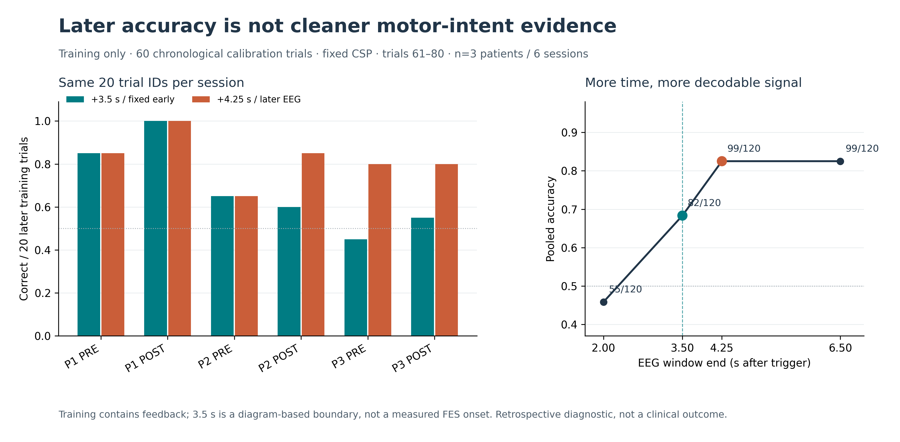
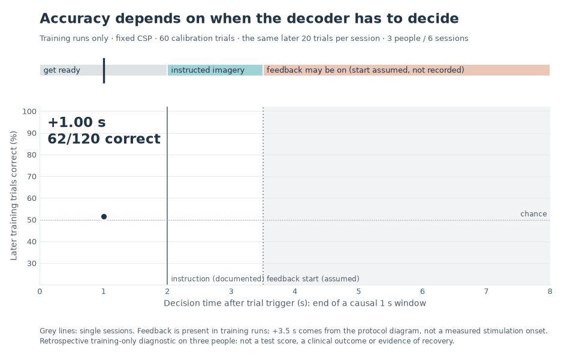

# Stroke Rehab / G27

**Question:** Can we decode instructed hand imagery early enough for a plausible brain–computer interface (BCI), without confusing a high late score with evidence of rehabilitation?

We analyze the BR41N.IO Stroke Rehab recordings for **three participants, two sessions each**. Every session has 80 calibration trials and 80 test trials. The test files were inspected during development: results on them are **exploratory, not blind validation**. The organizer allows feedback-period data and scores the **maximum over time of mean test-trial accuracy**; our fixed-time early decisions answer a different question.

> **Bottom line:** On six training runs, a fixed causal common spatial patterns (CSP) decoder with 60 calibration trials gets **82/120** on the same later trials at +3.5 s and **99/120** at +4.25 s. The improvement may include visual or electrical feedback; the files contain **no per-trial stimulation timestamps**. A more complex training-selected early policy scores **75/120**, below fixed CSP. Neither result proves motor-intent specificity or clinical recovery.



*First 60 training trials calibrate each model; trials 61–80 per session are scored at each time. Six sessions belong to three people. The +3.5 s feedback boundary comes from a diagram, not recorded functional electrical stimulation (FES) onsets. [Data and methods](docs/forward_calibration.md) · [Figure source and counts](results/jury_tradeoff/same_tail_counts.csv).*



*The same design swept through the whole trial in 0.25 s steps: one causal 1 s window ending at each decision time, six training runs, trials 61–80. It passes through the same 82/120 and 99/120 as the figure above. Grey lines are single sessions. The +3.5 s boundary is assumed from the protocol diagram, and feedback is present in training runs, so the rise after it is not evidence of cleaner motor intent. [Counts](results/decision_clock/decision_clock_counts.csv) · [static final frame](results/decision_clock/decision_clock.png) · `python analysis/decision_clock.py`.*

## Start here

| Need | Read or run |
|:--|:--|
| Understand the datasets, labels, leakage risks and exact metrics | [Evaluation contract](docs/protocol.md) |
| Find an experiment, CLI command, output and caveats | [Experiment guide](docs/experiments.md) |
| Compare our fixed-time and organizer-style scores without mixing them | [Scorecard](docs/index.md#scorecard) and [organizer metric](docs/organizer_metric.md) |
| Inspect reproducibility, older analyses and pull-request receipts | [Documentation map](docs/index.md) |

## Reproduce

Requires **Python 3.11+** and system `libarchive` support for RAR files (for example `libarchive13` on Debian/Ubuntu). From the repository root:

```bash
python -m venv .venv
. .venv/bin/activate
python -m pip install -e '.[test]'
stroke-rehab download              # checksum-verify and unpack into ignored data/
stroke-rehab inventory             # validate the 12 MAT recordings
stroke-rehab forward-calibration  # training runs only; may take time
python analysis/jury_tradeoff.py   # regenerate the figure from trial predictions
python -m pytest -q               # data-free regression checks
```

`stroke-rehab download` fetches about 175 MB from the organizer and verifies SHA-256 **before extraction**. If you already have the official archive, put it in `data/stroke-rehab.rar` and run the same command. Raw files, fitted models, temporary files and caches must remain out of Git. You can inspect the saved figure and CSVs without downloading data; rerunning EEG-dependent analyses needs the official archive. See [all commands and output locations](docs/experiments.md) and [dependency options](pyproject.toml).

## Results you can and cannot compare

| Analysis | Reported observation | What it means |
|:--|:--|:--|
| Fixed causal CSP, +3.5 s | **82/120** later training trials, 60 calibrated per run | Same-tail, training-only diagnostic, not a new patient test. |
| Fixed causal CSP, +4.25 s | **99/120** on the *same* trials | More time also permits possible feedback exposure. |
| Training-selected early CSP/Riemannian policy | **75/120** at +3.5 s | No improvement over fixed CSP on these training tails. |
| Causal sequential CSP control | **245/360**, trials 21–80, fit only on earlier trials | Different calibration regime and trial set: not comparable to 82/120. |
| Organizer-style fixed +3.5 s test curve | **358/480** on previously inspected test files | Different model fit (all 80 training trials) and exposed test runs. |
| Organizer-style sum of session-specific test peaks | **427/480** | Each time chosen *after seeing test labels*: **not a prospective accuracy**. |

These rows use different models, windows, trial sets or selection rules; **do not rank them as a leaderboard**. [Exact definitions and additional numbers](docs/index.md#scorecard).

## Boundaries of the claim

- A trial's cue indicates **left or right instructed imagery**, not observed movement or the affected side of the patient's body. PRE and POST are repeated sessions of three people, not evidence of treatment efficacy.
- A cue-locked voltage control scores **69/80** for P1 POST shortly after the visual instruction (versus **40/80** before it). This is an unresolved alternative source of decodable information, not proof that all CSP features are visual artifacts.
- Channel names are inferred by signal-topology checks and remain unconfirmed, including left–right orientation. Avoid lesion-side, ipsilesional and contralesional claims. Feedback start is **not measured trial-by-trial**.
- Our causal replay processes stored EEG in chunks and fails closed on decoder errors. It is **not** a live clinical device, a stimulation controller, or a measurement of acquisition-to-feedback latency.

## Repository map

- [`stroke_rehab/`](stroke_rehab/) — loader, feature extraction, models and command-line interface.
- [`configs/`](configs/) — experiment settings; [`analysis/`](analysis/) — figure/report reproduction.
- [`results/`](results/) — derived tables, figures and provenance; [`tests/`](tests/) — synthetic regression tests.
- [`docs/`](docs/) — protocols, evidence map, limitations and historical integration notes.

**Team:** [Anna Sokolova](https://github.com/ZyntZ) · [Jason Wang](https://github.com/wjason00) · [Sudip Sharma](https://github.com/nxxis).
